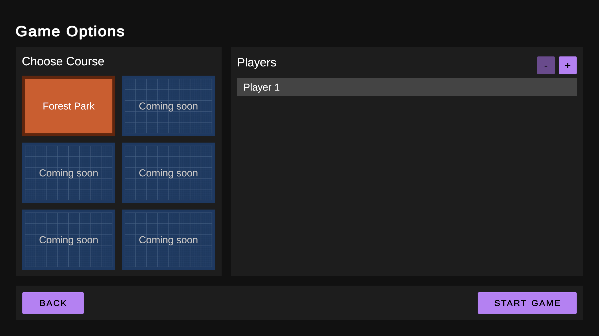
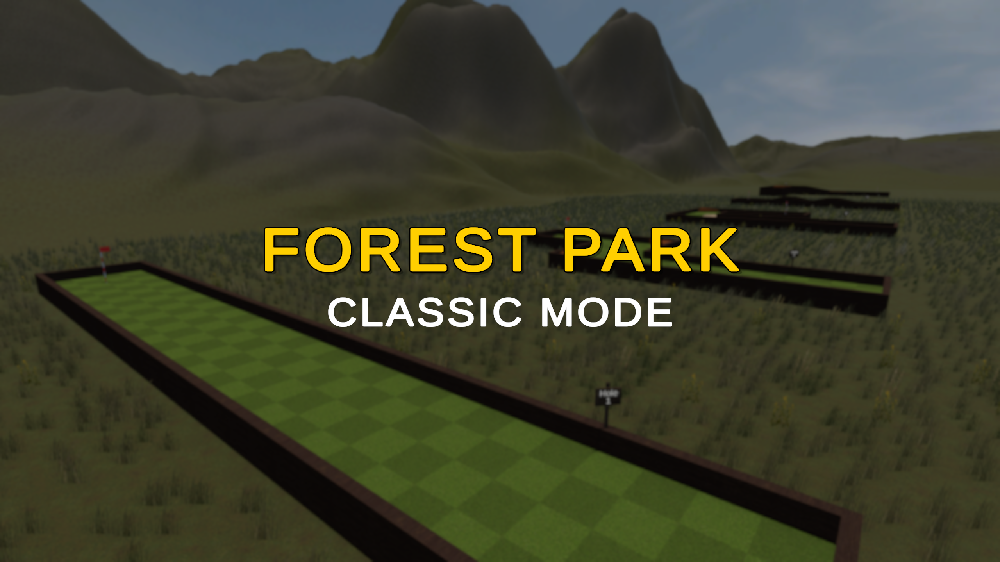
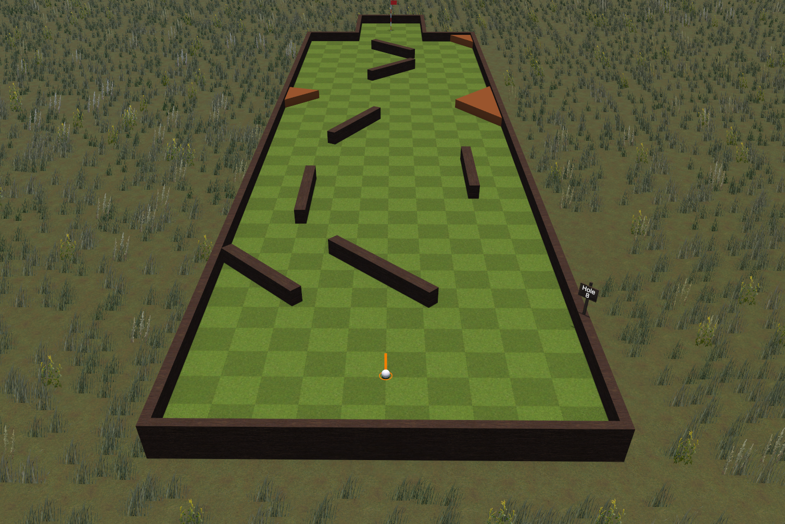
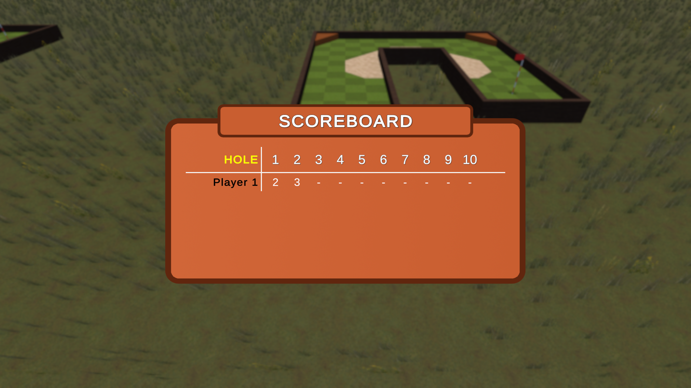

# Mini Golf Resort

> Project for the "Game Development" course, academic year: 2025
>
> Author: _Lorenzo Coppi_

## Description

Mini Golf Resort is a simulator of miniature golf courses, where you control the ball in first person and aim to score all holes in the fewest strokes possible.

## Author information

The project was developed by only one person, Lorenzo Coppi. Therefore, I worked on all the various aspects of the game and faced all the multiple challenges described in this report.

## Game Mechanics

### Controls

The game aims to be simple and easy to play, requiring only the mouse to control all the various aspects of the golf ball. As can be seen in the instructional section in the main menu, these are the available commands:

- Control the camera zoom using the mouse wheel
- Change the orientation of the ball by moving the mouse horizontally
- Change the throwing power by left-clicking the mouse while moving it vertically
- Throw the ball by right-clicking the mouse
- View the Scoreboard with "Tab"
- Pause the game with "Esc"

### Gameplay Mechanics

The various holes in the course provide mechanics to show how balls react to different scenarios. These mechanics include:

- Slopes and Jumps to show the effect of gravity on the ball whilst also making the game more fun to play
- Different physical properties for the ground materials: grass and sand provide different friction values and drag resistance to simulate how different ground materials make the holes harder
- Bouncy walls have higher bounciness compared to standard walls and, therefore, make the ball bounce in an unexpectedly fun way around the course.

### UI

The Main Menu greets users with a friendly Material Design interface that guides them through learning how the game works and setting up a new match, changing the active course and player count. When the game is started, the controller automatically loads the proper course scene and hands control over to the in-game controller, which then initiates the actual game using the options configured in the main menu.

Within the game, you can access the scoreboard, which dynamically displays a table showing all players, hole numbers, and scores.

## Key Design Choices

Here is some more in-depth information about the main design choices that are worth mentioning:

- The game utilizes a static global "StateManager" class, which both the MainMenu and InGame controllers access to share the settings configured by the user in the Main Menu, such as player count and selected course.
- Each course has a main "GameController" that oversees and manages all the steps of the game, deciding what to do and then delegating the final actions to the respective controllers, such as the PlayerController or the ScoreboardController. It also dynamically instances all the prefabs only when required, making this a modular and versatile approach that can work with multiple courses, each with different properties.
- Sounds have been integrated into the game to respond to various actions, from a ball bouncing off the wall; to different sounds for when the ball is thrown; to background noise and music to greet the players. Many of these sounds are played through a custom ImpactEvent sound controller that also scales the sound volume and pitch based on the strength of the impact between the objects; useful, for example, for managing the ball colliding sounds in order to make the sound lower when the obstacle is touched with a low force compared to when it is hit at full power.
- A modular "CameraTracker" component has been created for the camera, allowing for the tracking of the golf ball as it rolls while also enabling a smooth zoom curve that controls both distance and height using only the mouse wheel. All these options have been configured as editor variables, allowing them to be easily changed and refined directly from the Unity editor.
- Lastly, high-quality graphics were imported as assets in the game to try to replicate a similar real-world experience and stand out from a simple arcade game. All the various terrains and obstacles feature materials with textures, along with their corresponding light and height maps, to make them appear more realistic. Additionally, some thought was also given to the terrain around the map, providing mountains, grass, and flowers that all react to the wind and light.

## Development Challenges

Here are the main challenges faced during the development of the game, with how they were dealt with and solved:

- The level design of the various holes may seem easy at first, but it requires some consideration, as the tools provided by Unity itself have some limitations. To properly align and create these courses, I utilized the "ProBuilder" and "ProGrids" extensions from the Unity Asset Store, which enable fine-grained editing of multiple objects. To create some elements of the courses, such as slopes and ground holes, I also used the modeling software "Blender" to create SFX models, which I then imported into Unity.
- Making the ball's rotation and collisions feel realistic yet also fun was not a given. While Unity provides the basis for simulating the physics behind the interactions, considerable thought was given to properly fine-tuning the golf ball parameters related to angular drag, material friction, and bounciness, as well as configuring the collision meshes for all objects.
- While the high-quality Graphics are mainly just free assets found on the Unity store or other websites, they had to be appropriately utilized to create materials that correctly wrap the various objects and interact with the light and other materials.
- The Terrain Design required the use of Unity's "Terrain" tool, which provides numerous functionalities for creating heights and painting ground and grass textures around the map. In addition to finding the correct texture, consideration was also given to using appropriately sized textures that could be painted as Billboard materials around the map. This allows to have much grass and effects in a very efficient way.
- Finally, handling many players required to make everything modular and Event-based. To start, the player's balls are dynamically instanced at the beginning of the game based on the number of players. Then, during the game, the GameController handles all game aspects and, after determining the turn order, gives control to the respective "PlayerController" until the ball is thrown. Then, after the ball stops, an event is raised. Then, control is returned to the GameController, which sets up the camera for the following players and performs all the turn-change logic required to implement a hot-seat mode, where each player takes a turn in order until all have completed the hole. When all players have finished, the scores are updated on the scoreboard, and the GameController switches to the next hole, then resumes the turn system.

## Screenshots

Game options screen

Forest Park - Intro

Forest Park - Hole 3

Forest Park - Hole 6

Forest Park - Hole 8

Forest Park - Hole 10

Game Scoreboard

## Releases

- __[v1.0.0]__: 2025-06-24
